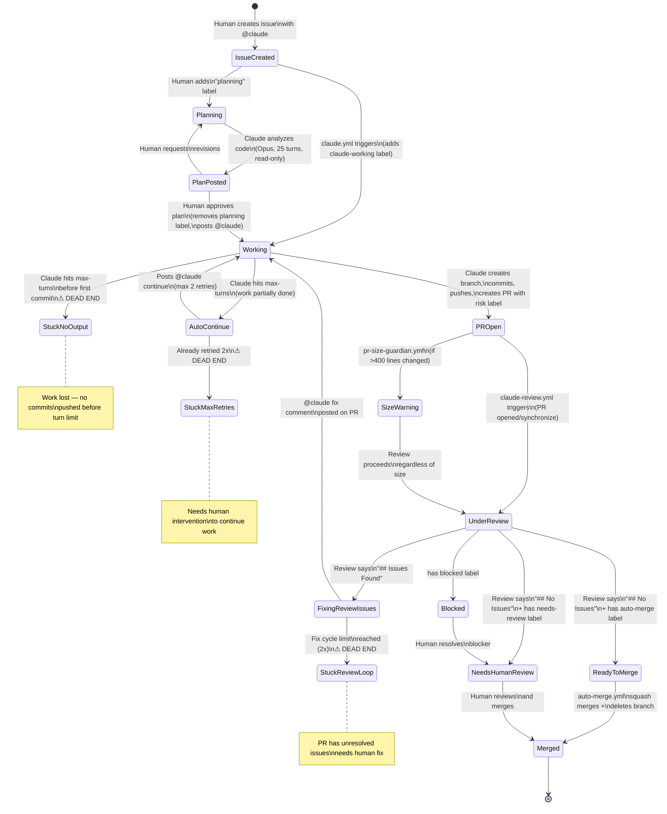
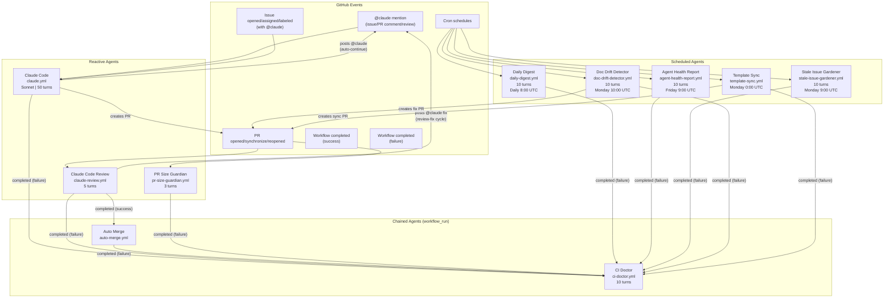
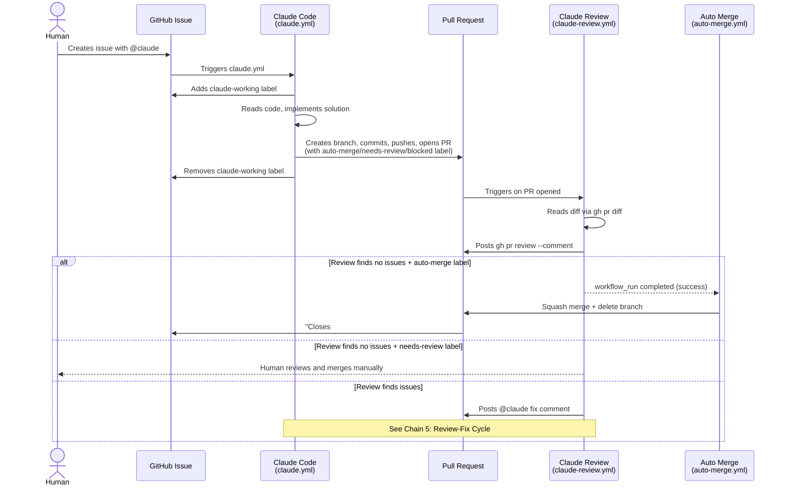
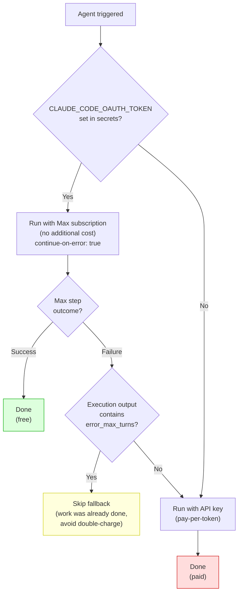

# Automated Developer Framework — System Architecture

> A complete reference for the multi-agent automation system built on GitHub Actions and Claude Code.
> This document describes every workflow, label, state transition, handoff chain, and known edge case.

---

## Table of Contents

1. [System Overview](#system-overview)
2. [The 10 Workflows (Agents)](#the-10-workflows-agents)
3. [The Label System](#the-label-system)
4. [Primary State Machine — Issue Lifecycle](#primary-state-machine--issue-lifecycle)
5. [Workflow Trigger Map](#workflow-trigger-map)
6. [Agentic Handoff Chains](#agentic-handoff-chains)
7. [Authentication Flow](#authentication-flow)
8. [Edge Cases & Stuck States](#edge-cases--stuck-states)
9. [Document Specification](#document-specification)
10. [Test Findings Reference](#test-findings-reference)

---

## System Overview

This is a **GitHub Actions-based multi-agent automation framework** built entirely on workflow YAML files and the `anthropics/claude-code-action@v1` GitHub Action. There is no application code — the entire system is workflow orchestration.

**Core concept:** Agents are Claude Code instances that run in CI, triggered by GitHub events, and hand off to each other via **labels**, **comments**, and **workflow chaining** (`workflow_run`).

**Key design principles:**
- **Label-driven routing** — Labels act as state markers that control which agent acts next
- **Event-driven triggers** — GitHub events (comments, PR opens, workflow completions) trigger agent execution
- **Self-healing loops** — Review-fix and auto-continue cycles allow agents to correct their own work
- **Loop protection** — All cycles have hard limits (2 iterations) to prevent infinite loops
- **Cost protection** — Max-first auth with fallback skip on turn exhaustion prevents double-charging

---

## The 10 Workflows (Agents)

### Reactive Agents (Event-Driven)

| # | Workflow | File | Trigger | Role |
|---|---------|------|---------|------|
| 1 | **Claude Code** | `claude.yml` | `@claude` mention in issues/PR comments/PR reviews; issue opened/assigned/labeled with `@claude` | Primary implementer — reads code, writes code, creates PRs |
| 2 | **Claude Code Review** | `claude-review.yml` | PR opened / synchronize / reopened | Code reviewer — posts review via `gh pr review` |
| 3 | **Auto Merge** | `auto-merge.yml` | `workflow_run` completed (after Claude Code Review) | Merges PRs labeled `auto-merge` |
| 4 | **CI Doctor** | `ci-doctor.yml` | `workflow_run` completed with `failure` (watches 9 specifically listed workflows: Claude Code, Claude Review, Auto Merge, PR Size Guardian, Daily Digest, Agent Health Report, Stale Issue Gardener, Doc Drift Detector, Template Sync) | Diagnoses failures, posts comments |
| 5 | **PR Size Guardian** | `pr-size-guardian.yml` | PR opened / synchronize | Warns if PR exceeds 400 lines changed |

### Scheduled Agents (Cron)

| # | Workflow | File | Schedule | Role |
|---|---------|------|----------|------|
| 6 | **Daily Digest** | `daily-digest.yml` | Daily, 8:00 UTC | Creates summary issue of last 24h activity |
| 7 | **Agent Health Report** | `agent-health-report.yml` | Friday, 9:00 UTC | Weekly stats on agent effectiveness |
| 8 | **Stale Issue Gardener** | `stale-issue-gardener.yml` | Monday, 9:00 UTC | Marks stale issues, closes abandoned, labels unlabeled |
| 9 | **Doc Drift Detector** | `doc-drift-detector.yml` | Monday, 10:00 UTC | Compares docs vs code, opens fix PRs |
| 10 | **Template Sync** | `template-sync.yml` | Monday, 0:00 UTC | Syncs workflow updates from template repo |

---

## The Label System

Labels serve as **state markers** and **routing signals** between agents.

| Label | Set By | Read By | Purpose |
|-------|--------|---------|---------|
| `claude-working` | Claude Code (Apply working label step) — only on `issues` and `issue_comment` events, NOT on PR review events | Humans | Indicates agent is actively processing an issue |
| `planning` | Human (manually) | Claude Code (Detect planning mode step) | Switches agent to plan-only mode (Opus, 25 turns, no edit permissions) |
| `auto-merge` | Claude Code (on PR creation via `gh pr create --label`) | Auto Merge workflow | PR is safe to merge without human review |
| `needs-review` | Claude Code (on PR creation) | Humans | PR requires human review before merge |
| `blocked` | Claude Code (on PR creation) | Humans | PR cannot proceed without human input |
| `stale` | Stale Issue Gardener | Stale Issue Gardener (on next weekly run) | Issue has 30+ days of inactivity; will close at 60 days |
| `daily-digest` | Daily Digest | Stale Issue Gardener (skip list) | Marks digest issues to exclude from gardening |
| `agent-health-report` | Agent Health Report | Stale Issue Gardener (skip list) | Marks health reports to exclude from gardening |
| `gardener-report` | Stale Issue Gardener | Stale Issue Gardener (skip list) | Marks gardener reports to exclude from gardening |
| `template_sync` | Template Sync | PR Size Guardian (skip check) | Marks template sync PRs; skips size check |
| `bug`, `feature`, `documentation`, `question` | Stale Issue Gardener | Humans | Auto-applied to unlabeled issues based on content analysis |

### Label State Transition Rules

```
No labels → claude-working     (when Claude Code starts processing on issue events)
claude-working → (removed)      (when Claude Code finishes, success or failure)
No labels → planning            (human adds manually to request plan-first)
planning → (removed)            (automatically when workflow detects approval keywords like "approve", "implement", "proceed" in comment, OR manually by human)
PR created → auto-merge         (Claude assesses risk as low)
PR created → needs-review       (Claude assesses risk as moderate/high, or uncertain)
PR created → blocked            (Claude cannot proceed without human input)
No labels → stale               (30+ days inactive, set by Gardener)
stale → (issue closed)          (60+ days inactive, closed by Gardener)
No labels → bug/feature/etc.    (Gardener auto-labels based on content)
```

---

## Primary State Machine — Issue Lifecycle

This is the complete lifecycle of an issue from creation through resolution.

### Mermaid Diagram



### ASCII Diagram

```
                            ┌─────────────────────────────────────────────────┐
                            │              ISSUE CREATED                      │
                            │         (Human posts @claude)                   │
                            └──────────┬──────────────┬───────────────────────┘
                                       │              │
                          Human adds   │              │  claude.yml triggers
                        "planning" label              │
                                       │              │
                                       ▼              ▼
                            ┌──────────────┐  ┌──────────────┐
                            │   PLANNING   │  │   WORKING    │
                            │  Opus model  │  │ Sonnet model │
                            │  25 turns    │  │  50 turns    │
                            │  read-only   │  │  full access │
                            └──────┬───────┘  └──┬─────┬─────┘
                                   │             │     │
                                   ▼             │     │
                            ┌──────────────┐     │     │  Hit max-turns
                            │ PLAN POSTED  │     │     │  before commit
                            │  (comment)   │     │     ├──────────────────┐
                            └──────┬───────┘     │     │                  ▼
                                   │             │     │          ┌──────────────┐
                    Human approves │             │     │          │ ⚠ STUCK:     │
                    removes label  │             │     │          │ NO OUTPUT    │
                    posts @claude  │             │     │          │ (work lost)  │
                                   │             │     │          └──────────────┘
                                   └─────────────┘     │
                                                       │  Hit max-turns
                                                       │  after some commits
                                                       ▼
                                               ┌──────────────┐
                                               │AUTO-CONTINUE │  ──── Already 2x? ──── ┐
                                               │ Posts @claude │                         ▼
                                               │ continue     │               ┌──────────────┐
                                               └──────┬───────┘               │ ⚠ STUCK:     │
                                                      │                       │ MAX RETRIES  │
                                                      │ Re-triggers           └──────────────┘
                                                      │ claude.yml
                                                      ▼
                            ┌─────────────────────────────────────────────────┐
                            │                   PR OPEN                       │
                            │        (branch pushed, PR created)              │
                            │    Labels: auto-merge | needs-review | blocked  │
                            └──────────┬──────────────────────────────────────┘
                                       │
                         ┌─────────────┤  claude-review.yml
                         │             │  triggers
                         ▼             ▼
              ┌──────────────┐  ┌──────────────┐
              │ SIZE WARNING │  │UNDER REVIEW  │
              │ (>400 lines) │  │ (5 turns)    │
              │  informational│  └──┬─────┬─────┘
              └──────────────┘     │     │
                                   │     │
                  "## No Issues"   │     │  "## Issues Found"
                                   │     │
                    ┌──────────────┘     └──────────────┐
                    │                                    │
                    ▼                                    ▼
        ┌───────────────────┐               ┌──────────────────┐
        │  auto-merge label │               │ FIXING REVIEW    │
        │         │         │               │ ISSUES           │
        │         ▼         │               │ (@claude fix)    │
        │  ┌────────────┐   │               └──┬───────────────┘
        │  │ READY TO   │   │                  │
        │  │ MERGE      │   │                  │  Cycle limit
        │  └─────┬──────┘   │     Re-triggers  │  reached (2x)?
        │        │          │     claude.yml    │
        │        ▼          │         │         ├──── Yes ────┐
        │  ┌────────────┐   │         │         │             ▼
        │  │  MERGED    │   │   ┌─────┘         │   ┌──────────────┐
        │  │ (squash +  │   │   │               │   │ ⚠ STUCK:     │
        │  │ delete br) │   │   ▼               │   │ REVIEW LOOP  │
        │  └────────────┘   │  WORKING          │   └──────────────┘
        │                   │  (fixes issues)   │
        └───────────────────┘                   │
                                                │
        ┌───────────────────┐                   │
        │ needs-review label│         No ───────┘
        │         │         │         (back to UNDER REVIEW
        │         ▼         │          on synchronize event)
        │  ┌────────────┐   │
        │  │NEEDS HUMAN │   │
        │  │ REVIEW     │───┼──── Human merges ──── MERGED
        │  └────────────┘   │
        └───────────────────┘

        ┌───────────────────┐
        │  blocked label    │
        │         │         │
        │         ▼         │
        │  ┌────────────┐   │
        │  │  BLOCKED   │───┼──── Human resolves ──── NEEDS HUMAN REVIEW
        │  └────────────┘   │
        └───────────────────┘
```

---

## Workflow Trigger Map

Shows which GitHub events trigger which workflows, and which workflow completions chain to other workflows.

### Mermaid Diagram



### ASCII Diagram

```
GITHUB EVENTS                    WORKFLOWS                          CHAINED WORKFLOWS
═══════════════                  ═════════                          ═════════════════

@claude mention ──────────────►  Claude Code (claude.yml)
(issue/PR comment/review)        Sonnet | 50 turns
                                      │
Issue opened/assigned/labeled ────────┘
(with @claude in body/title)          │
                                      │ creates PR ─────────────────────────────┐
                                      │ posts @claude continue ─────┐           │
                                      │                             │           │
                                      │◄────────────────────────────┘           │
                                      │                                         │
                                                                                │
PR opened/synchronize/reopened ──►  Claude Code Review (claude-review.yml)      │
     ▲                               5 turns                                    │
     │                                    │                                     │
     │                                    │ posts @claude fix ──► Claude Code   │
     │                                    │                                     │
     │                                    │ completed (success)                 │
     │                                    └──────────────────►  Auto Merge      │
     │                                                          (auto-merge.yml)│
     │                                                                          │
     ├──────────────────────────────────────────────────────────────────────────┘
     │
PR opened/synchronize ───────►  PR Size Guardian (pr-size-guardian.yml)
                                 3 turns
                                 Skips template_sync labeled PRs


9 specific workflows fail ────►  CI Doctor (ci-doctor.yml)
                                 10 turns | read-only
                                 Posts diagnostic comment
                                 Watches: Claude Code, Claude Review,
                                 Auto Merge, PR Size Guardian,
                                 Daily Digest, Agent Health Report,
                                 Stale Issue Gardener, Doc Drift Detector,
                                 Template Sync


Cron daily 8:00 UTC ──────────►  Daily Digest (daily-digest.yml)
                                 10 turns | creates issue

Cron Friday 9:00 UTC ─────────►  Agent Health Report (agent-health-report.yml)
                                 10 turns | creates issue

Cron Monday 9:00 UTC ─────────►  Stale Issue Gardener (stale-issue-gardener.yml)
                                 10 turns | edits/closes issues

Cron Monday 10:00 UTC ────────►  Doc Drift Detector (doc-drift-detector.yml)
                                 10 turns | creates fix PRs ──────► PR events

Cron Monday 0:00 UTC ─────────►  Template Sync (template-sync.yml)
                                 Creates sync PR ─────────────────► PR events
```

---

## Agentic Handoff Chains

These are the five paths where one agent's output triggers another agent's execution.

### Chain 1: Issue to Implementation to Review to Merge (Main Development Loop)

This is the primary development workflow — the "happy path."



```
ASCII — Chain 1: Main Development Loop

  Human                Issue              Claude Code           PR              Review            Auto Merge
    │                   │                    │                  │                 │                   │
    │ creates issue     │                    │                  │                 │                   │
    │ with @claude      │                    │                  │                 │                   │
    ├──────────────────►│                    │                  │                 │                   │
    │                   │  triggers          │                  │                 │                   │
    │                   ├───────────────────►│                  │                 │                   │
    │                   │                    │                  │                 │                   │
    │                   │◄── add label ──────┤                  │                 │                   │
    │                   │   claude-working   │                  │                 │                   │
    │                   │                    │                  │                 │                   │
    │                   │                    │ read code,       │                 │                   │
    │                   │                    │ implement,       │                 │                   │
    │                   │                    │ commit, push     │                 │                   │
    │                   │                    │                  │                 │                   │
    │                   │                    ├─ create PR ─────►│                 │                   │
    │                   │                    │  + risk label    │                 │                   │
    │                   │                    │                  │                 │                   │
    │                   │◄── remove label ───┤                  │                 │                   │
    │                   │   claude-working   │                  │                 │                   │
    │                   │                    │                  │  PR opened      │                   │
    │                   │                    │                  ├────────────────►│                   │
    │                   │                    │                  │                 │                   │
    │                   │                    │                  │                 │ reads diff,       │
    │                   │                    │                  │                 │ posts review      │
    │                   │                    │                  │                 │                   │
    │                   │                    │                  │◄── review ──────┤                   │
    │                   │                    │                  │                 │                   │
    │                   │                    │                  │                 │ workflow_run      │
    │                   │                    │                  │                 │ completed         │
    │                   │                    │                  │                 ├──────────────────►│
    │                   │                    │                  │                 │                   │
    │                   │                    │                  │                 │    if auto-merge  │
    │                   │                    │                  │◄── squash merge + delete branch ───┤
    │                   │                    │                  │                 │                   │
    │◄──── issue closed (Closes #N) ────────┤                  │                 │                   │
    │                   │                    │                  │                 │                   │
```

### Chain 2: CI Failure to Diagnosis

```
ANY workflow fails
  └──► ci-doctor.yml triggers (workflow_run completed + conclusion == failure)
        └──► Claude reads failed logs via `gh run view <id> --log-failed`
              └──► Reads diff via `gh pr diff` (or git diff if no PR)
                    └──► Posts diagnostic comment on PR (or on commit if no PR)
                          Format: 1) What failed  2) Why it failed  3) Suggested fix
```

### Chain 3: Planning Mode (Human-Gated)

```
Human adds "planning" label to issue
  └──► claude.yml detects label in "Detect planning mode" step
        └──► Switches to planning mode:
              • Model: claude-opus-4-6 (stronger reasoning)
              • Max turns: 25 (instead of 50)
              • NO file editing, NO branch creation, NO PR creation
              • Appended system prompt enforces read-only behavior
        └──► Claude reads codebase, posts plan as comment, stops

Human reviews plan
  ├──► Requests revisions → posts comment with @claude → Claude revises (still in planning mode)
  └──► Approves plan → posts comment with approval keywords ("approve", "implement", "proceed")
        └──► "Detect plan approval and remove planning label" step automatically removes planning label
              └──► Mode detection re-runs, detects NO planning label
                    └──► claude.yml continues in IMPLEMENTATION mode:
                          • Model: claude-sonnet-4-5-20250929
                          • Max turns: 50
                          • Full permissions: edit files, create branches, push, create PRs
                          • --dangerously-skip-permissions enabled
                          • Specific --allowedTools for gh commands alongside permissions skip
```

### Chain 4: Auto-Continue on Turn Exhaustion

```
Claude hits --max-turns during implementation
  └──► claude.yml "Auto-continue on turn exhaustion" step runs (always)
        └──► Checks execution output for "error_max_turns"
              └──► IF found:
                    └──► Checks if work is already complete:
                          ├──► Is issue already closed? → SKIP auto-continue (work done)
                          ├──► Does an open PR already reference this issue? → SKIP auto-continue (work done)
                          └──► Work NOT complete:
                                └──► Counts existing <!-- auto-continue --> markers
                                      ├──► IF count < 2: posts @claude continue comment
                                      │     └──► Re-triggers claude.yml
                                      │           └──► Claude resumes work (checks for existing branches/commits)
                                      └──► IF count >= 2: stops (prevents infinite loop)
                                            └──► ⚠ DEAD END: needs human intervention
```

### Chain 5: Review-Fix Cycle (Self-Healing)

```
claude-review.yml finishes reviewing a PR
  └──► "Request fixes for review findings" step runs (always)
        └──► Counts existing <!-- review-fix-cycle --> markers in PR comments
              └──► IF count < 2:
                    └──► Fetches latest review body via GitHub API
                          └──► IF first line contains "## Issues Found":
                                └──► Posts @claude fix comment (with <!-- review-fix-cycle --> marker)
                                      └──► claude.yml triggers on issue_comment
                                            └──► Claude reads review, fixes issues, pushes new commits
                                                  └──► claude-review.yml triggers on synchronize
                                                        └──► Re-reviews the PR
                                                              └──► Cycle repeats (max 2 iterations)
              └──► IF count >= 2:
                    └──► ⚠ STOPS: "Auto-fix cycle limit reached"
                          └──► PR sits with unresolved review issues
                                └──► Needs human intervention
```

---

## Authentication Flow

All Claude-powered agents use the same two-tier authentication strategy.

### Mermaid Diagram



### ASCII Diagram

```
                        ┌─────────────────┐
                        │ Agent triggered  │
                        └────────┬────────┘
                                 │
                                 ▼
                    ┌────────────────────────┐
                    │ CLAUDE_CODE_OAUTH_TOKEN │
                    │ set in secrets?         │
                    └──────┬─────────┬───────┘
                     Yes   │         │  No
                           ▼         │
                  ┌──────────────┐   │
                  │ Run with Max │   │
                  │ subscription │   │
                  │ (free)       │   │
                  │ continue-on- │   │
                  │ error: true  │   │
                  └──────┬───────┘   │
                         │           │
                         ▼           │
                  ┌──────────────┐   │
                  │ Max step     │   │
                  │ succeeded?   │   │
                  └──┬───────┬───┘   │
               Yes   │       │ No    │
                     ▼       ▼       │
              ┌─────────┐ ┌──────────────┐
              │  DONE   │ │ Execution    │
              │ (free)  │ │ output has   │
              └─────────┘ │error_max_turns│
                          │ ?            │
                          └──┬───────┬───┘
                       Yes   │       │ No
                             ▼       │
                    ┌────────────┐   │
                    │ SKIP       │   │
                    │ FALLBACK   │   │
                    │ (avoid     │   │
                    │ double-    │   │
                    │ charge)    │   │
                    └────────────┘   │
                                     │
                                     ▼
                            ┌──────────────┐
                            │ Run with     │
                            │ API key      │
                            │ (pay-per-    │
                            │ token)       │
                            └──────┬───────┘
                                   │
                                   ▼
                            ┌──────────────┐
                            │    DONE      │
                            │   (paid)     │
                            └──────────────┘
```

---

## Edge Cases & Stuck States

These are the identified failure modes where the system can get stuck or behave unexpectedly. Each represents a potential area for improvement.

### 1. Review-Fix Infinite Loop Protection

**What happens:** The review-fix cycle is limited to 2 iterations via `<!-- review-fix-cycle -->` HTML comment markers. If the fix introduces *new* issues on the second iteration, the cycle stops and the PR sits with unresolved problems.

**Current behavior:** PR remains open with unresolved review comments. No notification is sent.

**Impact:** Medium — PR requires human intervention to fix remaining issues.

**Potential improvement:** Post a summary comment when the cycle limit is reached, tagging the PR author or a reviewer.

### 2. Auto-Continue Turn Exhaustion

**What happens:** The auto-continue mechanism retries up to 2 times via `<!-- auto-continue -->` markers. If work can't complete in 3 x max-turns (150 total turns), it stops silently. The workflow includes completion checks (issue closed, open PR exists) to prevent unnecessary retries when work is already done.

**Current behavior:** No notification that auto-continue has been exhausted. The issue may have a partially completed branch/PR. The completion checks prevent retrying when an issue is closed or a PR already exists.

**Impact:** Medium — work is partially done but the human may not realize it's stalled. Mitigated by completion checks that skip auto-continue when work is detectably complete.

**Potential improvement:** Post a "max retries exhausted" comment on the issue when the limit is hit.

### 3. Planning to Implementation Gap

**What happens:** After Claude posts a plan in planning mode, there is no automated transition to implementation. The human must manually: (1) remove the `planning` label, (2) post a new `@claude` comment to trigger implementation.

**Current behavior:** The plan sits as a comment. If the human forgets or doesn't know the workflow, nothing happens.

**Impact:** Low — by design, this is human-gated. But the gap can cause confusion for new users.

**Potential improvement:** Add a note in the plan comment explaining the next step: "To implement this plan, remove the `planning` label and comment `@claude implement the approved plan`."

### 4. Lost Work on Max-Turns Before First Commit

**What happens:** If Claude hits the turn limit before pushing any commits or creating a PR, all work is lost. The runner terminates and there's no artifact.

**Current behavior:** The issue gets an auto-continue comment, but the next Claude run starts from scratch (no shared state between runs).

**Impact:** High — observed in test findings (Test 4). Investigation work and code changes are completely lost.

**Potential improvement:** The system prompt instructs "commit and push after EVERY meaningful change" and "create a PR early," but this is behavioral guidance, not enforced. Could add a step that checks for uncommitted changes on failure and force-pushes a WIP branch.

### 5. Stale Gardener vs Auto-Generated Issues

**What happens:** The Stale Issue Gardener explicitly skips issues labeled `daily-digest`, `agent-health-report`, and `gardener-report`. But if any auto-generated issue loses its label (manually or by accident), it could get stale-marked or closed.

**Current behavior:** No protection against label removal. A digest issue without its label looks like any other issue to the gardener.

**Impact:** Low — unlikely but possible if someone manually removes labels from agent-generated issues.

**Potential improvement:** The gardener could also check the issue title pattern (e.g., "Daily Digest —" or "Agent Health Report —") as a secondary filter.

### 6. Template Sync Conflicts

**What happens:** Template sync creates PRs to update workflow files from the template repository, but it doesn't resolve merge conflicts. If the downstream repo has diverged, the PR may have conflicts.

**Current behavior:** The PR sits open with conflicts. No notification beyond the PR itself.

**Impact:** Low — template sync PRs are informational. But if ignored, workflow files can fall behind.

**Potential improvement:** Add a label like `conflict` when the PR has merge conflicts, or have CI Doctor diagnose the failure.

### 7. No Cross-Agent State

**What happens:** Each agent run is stateless. If Claude Code creates a PR but the review-fix cycle fails, there's no mechanism to notify the original issue. If an auto-continue run starts, it must re-discover existing branches and commits via `gh` and `git` commands.

**Current behavior:** The auto-continue prompt says "Check for any existing branches or commits you have already made" — this is behavioral guidance, not guaranteed.

**Impact:** Medium — works most of the time because `gh` and `git` commands can discover prior work, but there's no formal state tracking between runs.

**Potential improvement:** Could use issue/PR comments as a lightweight state store (e.g., posting a JSON blob with branch name, commit SHA, progress status).

---

## Document Specification

This section defines the structure and conventions of this framework for anyone extending or debugging it.

### Workflow File Conventions

| Property | Convention |
|----------|-----------|
| **Location** | `.github/workflows/*.yml` |
| **Naming** | Kebab-case matching the workflow purpose (e.g., `claude-review.yml`) |
| **Action** | All Claude-powered agents use `anthropics/claude-code-action@v1` |
| **Auth pattern** | Max-first with fallback: Max step (`continue-on-error: true`) → check for `error_max_turns` → fallback to API key only if not turn-exhausted |
| **Turn limits** | Claude Code: 50, Review: 5, CI Doctor: 10, Size Guardian: 3, all scheduled: 10 |
| **Permissions** | Minimum required per workflow. Claude Code needs `contents: write`, `pull-requests: write`, `issues: write`. Review needs `contents: read`, `pull-requests: write`. |
| **PAT usage** | `PAT_TOKEN` used for operations that need to trigger other workflows (GITHUB_TOKEN doesn't trigger `workflow_run`) |

### Label Conventions

| Property | Convention |
|----------|-----------|
| **Risk labels** | Exactly one of: `auto-merge`, `needs-review`, `blocked` |
| **State labels** | `claude-working` (transient), `planning` (human-set), `stale` (gardener-set) |
| **Agent labels** | `daily-digest`, `agent-health-report`, `gardener-report`, `template_sync` — used for skip-list filtering |
| **Content labels** | `bug`, `feature`, `documentation`, `question` — auto-applied by gardener |
| **Label creation** | All labels are created on-demand with `gh label create --force` (idempotent) |

### Loop Protection Conventions

| Mechanism | Marker | Limit | Used By |
|-----------|--------|-------|---------|
| Auto-continue | `<!-- auto-continue -->` | 2 retries | claude.yml |
| Review-fix cycle | `<!-- review-fix-cycle -->` | 2 iterations | claude-review.yml |
| Detection method | `gh api .../comments` + `grep -c` marker | Count-based | Both |

### Agent Configuration Summary

| Agent | Model | Max Turns | Permissions | Special Flags |
|-------|-------|-----------|-------------|---------------|
| Claude Code (impl) | claude-sonnet-4-5-20250929 | 50 | Full write | `--dangerously-skip-permissions` + specific `--allowedTools` for gh commands |
| Claude Code (plan) | claude-opus-4-6 | 25 | Read-only | Planning system prompt |
| Claude Review | (default) | 5 | Read + PR write | `--dangerously-skip-permissions` |
| CI Doctor | (default) | 10 | Read + PR write | Specific `--allowed-tools` |
| PR Size Guardian | (default) | 3 | Read + PR write | `--dangerously-skip-permissions` |
| Daily Digest | (default) | 10 | Read + issues write | `--dangerously-skip-permissions` |
| Agent Health Report | (default) | 10 | Read + issues write | `--dangerously-skip-permissions` |
| Stale Issue Gardener | (default) | 10 | Read + issues write | Specific `--allowedTools` |
| Doc Drift Detector | (default) | 10 | Full write | Specific `--allowedTools` |

### System Prompt Injection Points

Claude Code (`claude.yml`) uses `--append-system-prompt` to inject mode-specific instructions:

- **Planning mode prompt:** Enforces read-only behavior, requires posting plan as comment
- **Implementation mode prompt:** Enforces commit-early/push-often workflow, PR creation, risk labeling, and turn-awareness

### Required Secrets

| Secret | Purpose | Used By |
|--------|---------|---------|
| `CLAUDE_CODE_OAUTH_TOKEN` | Max subscription auth (free tier) | All Claude-powered workflows |
| `ANTHROPIC_API_KEY` | API key fallback (paid) | All Claude-powered workflows |
| `PAT_TOKEN` | GitHub PAT for cross-workflow triggers and write operations | claude.yml, claude-review.yml, auto-merge.yml, doc-drift-detector.yml, template-sync.yml, stale-issue-gardener.yml |

### File Structure

```
.github/
  workflows/
    claude.yml              # Primary implementer agent
    claude-review.yml       # Code review agent
    auto-merge.yml          # Auto-merge agent (chained after review)
    ci-doctor.yml           # CI failure diagnostician (chained on any failure)
    pr-size-guardian.yml    # PR size checker
    daily-digest.yml        # Daily activity summary (cron)
    agent-health-report.yml # Weekly health metrics (cron)
    stale-issue-gardener.yml # Issue hygiene (cron)
    doc-drift-detector.yml  # Documentation accuracy (cron)
    template-sync.yml       # Template repository sync (cron)
.claude/
  settings.json             # Claude Code settings
  test-findings.md          # Comprehensive test results
.templatesyncignore         # Files excluded from template sync
CLAUDE.md                   # Repository instructions for Claude
README.md                   # Repository readme
docs/
  flow-diagram.md           # This file
```

---

## Test Findings Reference

Comprehensive test findings are documented in `.claude/test-findings.md`. Key results from testing (v2, 2026-02-15):

| Test | Score | Key Finding |
|------|-------|-------------|
| Template sync | PASS | `.templatesyncignore` works correctly |
| Feature implementation | 26/35 | PR created automatically; no risk label applied |
| Code review quality | 23/25 | 8/8 planted bugs caught (up from 5/8 in v1) |
| Follow-up correction | 21/25 | Both features implemented; double-charge bug hit |
| Underspecified bug report | 16/25 | Correct investigation; hit max-turns before commit |
| Daily digest | 18/20 | Accurate categorization and risk assessment |

**Overall score:** 104/130 (HIGH autonomy level)

**Fixed issues:** Double-charge bug (Max → API fallback on turn exhaustion), PR creation (now uses `gh pr create` directly), review format (structured `## Issues Found` / `## No Issues` headers).

**Known remaining issues:** Verbose output in issue comments (task checklists still appear despite CLAUDE.md instructions), occasional missing risk labels on PRs.

For full details including v1 comparison, debugging timelines, and all test artifacts, see `.claude/test-findings.md`.
